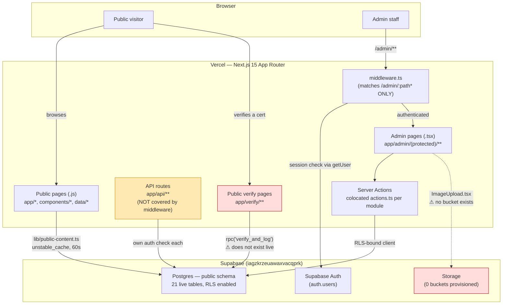
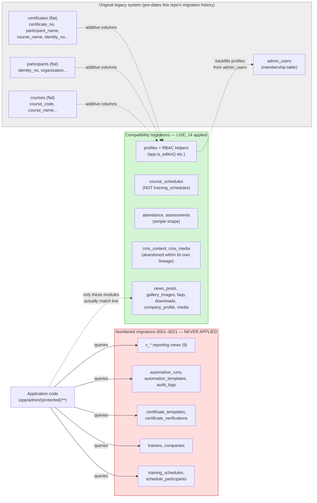
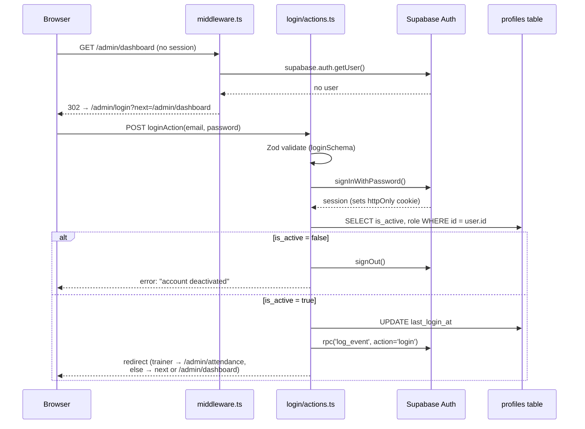
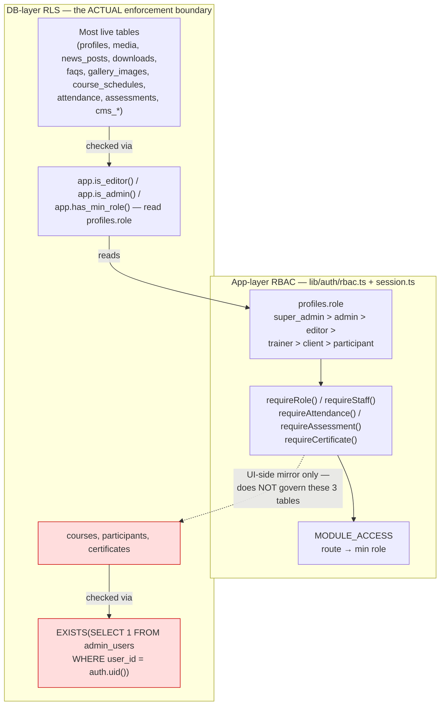
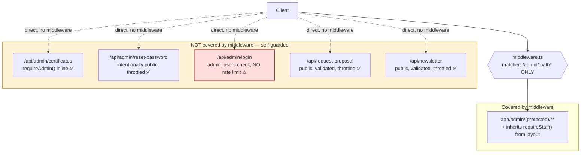
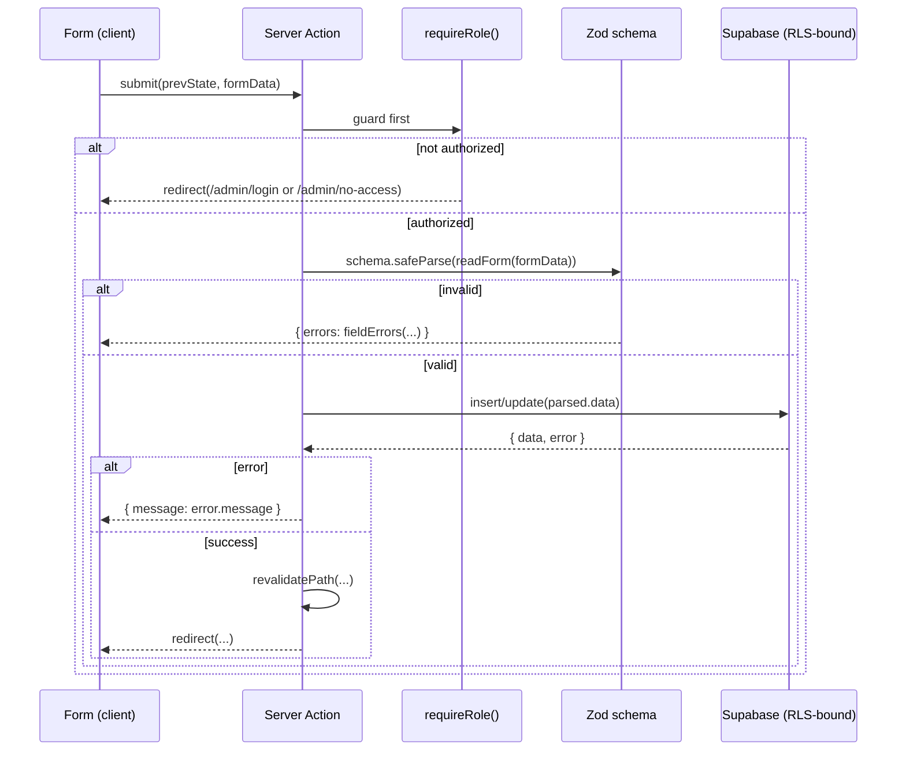
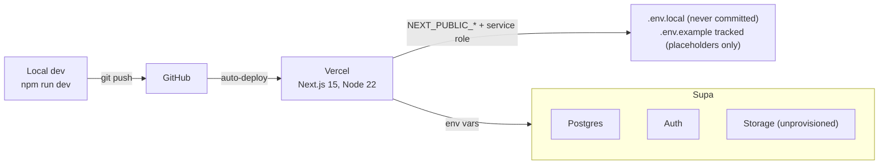

# MASTER_ARCHITECTURE.md — TERAS UNIVERSAL

Synthesized from `CLAUDE.md`, `PROJECT_SUMMARY.md`, `DATABASE_AUDIT.md`, `BUG_REPORT.md`, `SECURITY_REPORT.md`, `PERFORMANCE_REPORT.md`, and `MASTER_TODO.md` — all produced this session by direct inspection of the codebase and the live, connected Supabase project (`iagzkrzeuawaxvacqprk`). Where this document and `PROJECT_SUMMARY.md` (an earlier, static-analysis-only pass) disagree about what's *live* versus what's *designed*, this document defers to the live-database-verified reports, and says so explicitly — that distinction is the central fact of this codebase's current state. Documentation only; no source files were modified.

---

# Executive Summary

TERAS UNIVERSAL's website is one Next.js 15 application with two halves — a static-ish public marketing site and a Supabase-backed admin CMS/operations system — sharing one Vercel deployment. The public site works. The admin CMS was designed comprehensively (courses, schedules, participants, attendance, assessments, certificates, trainers, companies, reporting, automation) and has a large amount of well-structured, consistent code written for it — but **most of that code targets a database schema that was never applied to production.**

Two independently-designed schemas exist in this repo's history. Only the older, additive "compatibility" lineage — built on top of a pre-existing legacy certificate-verification system — is actually live. The newer, cleaner, more complete numbered migration set (`0001`–`0021`) that most of the operations UI assumes was never deployed. The result: Courses, News, Gallery, FAQ, Downloads, and Company Profile work (their data layer targets the live schema). Schedules, Trainers, Companies, Attendance, Assessment, the certificate engine, Automation, Reports, Audit, and Users do not — and neither does the single most public-facing feature on the entire site, certificate verification, which currently reports every genuine certificate as invalid.

This is not a collection of unrelated bugs. It is one architectural decision, deferred, with dozens of downstream symptoms. `DATABASE_AUDIT.md` §10 lays out the two ways to resolve it; `MASTER_TODO.md` sequences the resulting work. Everything else in this document — security posture, performance characteristics, the recommended refactoring — is best read with that one fact as context: **this codebase is closer to "well-designed but half-wired" than "poorly designed."**

---

# Current Architecture



**Stack**: Next.js 15.5 (App Router, React 19), Supabase (`@supabase/ssr`, `@supabase/supabase-js`), Zod, Resend (transactional email), `pdfjs-dist`/`tesseract.js` (bulk certificate PDF/OCR — built but unwired, see Certificate Engine), Vercel, Node 22. No ORM — direct Supabase client queries throughout. No test suite (no Jest/Vitest); verification relies on `npm run build` + `npm run typecheck`, and the latter provides materially less protection than it appears to (see Technical Debt).

---

# Business Modules

| Module | Live functional? | Notes |
|---|---|---|
| Courses | ✅ Yes | Reference implementation; live table has the CMS-presentation columns added by the compatibility migrations |
| News, Gallery, FAQ, Downloads, Company Profile | ⚠️ Partially | Data layer + `actions.ts` + create/edit forms work; **list pages are still `<ScaffoldPage>` placeholders** — a staff member can't reach the working CRUD without the direct URL |
| Media Library | ⚠️ Partially | Read-only browser works against the live `media` table; no dedicated uploader (uploads happen via raw URL fields elsewhere), and Storage itself has zero buckets provisioned |
| Schedules | ❌ No | Queries `training_schedules`, which doesn't exist live |
| Trainers | ❌ No | Queries `trainers`, which doesn't exist live |
| Companies | ❌ No | Queries `companies`, which doesn't exist live |
| Participants | ❌ No | Writes columns absent from the live table and `status` values that violate the live CHECK constraint |
| Attendance | ❌ No | Writes `attendance_status`/`check_in_time`/`check_out_time`, absent from the live table |
| Assessment | ❌ No | Writes `theory_score`/`practical_score`/`competency_status`, absent from the live table |
| Certificates (admin UI) | ❌ No | Writes `certificate_number`/`template_id`/`schedule_id`, absent from the live table |
| Certificates (`/api/admin/certificates`) | ✅ Yes | The one certificate code path that actually matches the live legacy column names — see API Architecture |
| Certificate verification (public `/verify`) | ❌ No | Calls `verify_and_log`, an RPC that doesn't exist live — see Certificate Engine |
| Automation Centre, Reports, Audit, Users | ❌ No | Depend on `automation_runs`, `v_*` views, `audit_logs`, none of which exist live |
| Dashboard | ❌ No (mostly) | Queries the same non-existent operations tables as the modules above |
| Global Search | ⚠️ Partially | 5 of 8 categories work (courses, participants, companies, news, downloads); 3 (schedules, trainers, certificate-number) silently return nothing |
| Contact Enquiries, Proposal Requests, Website Settings | N/A — out of scope | Tables + RLS exist; admin UI is deliberately not built, per `DELIVERABLE.md` |

Full evidence for every "not functional" row: `BUG_REPORT.md` BUG-01–07; live-schema confirmation: `DATABASE_AUDIT.md` §1–§6.

---

# Database Architecture



**21 live tables** (`public` schema): `profiles`, `admin_users`, `courses`, `participants`, `certificates`, `certificate_import_logs`, `course_schedules`, `attendance`, `assessments`, `cms_content`, `cms_media`, `media_folders`, `media`, `downloads`, `news_categories`, `news_posts`, `gallery_categories`, `gallery_images`, `faq_categories`, `faqs`, `company_profile`. `courses` holds 125 real rows; every other table is empty.

**Row Level Security**: enabled on all 21 tables, `FORCE` set on none (low real-world impact — `anon`/`authenticated` don't have `BYPASSRLS` regardless; only `service_role`/`postgres` do, and they bypass RLS irrespective of `FORCE`). The critical finding: `certificates`/`participants`/`courses` are gated exclusively by `admin_users` membership (a binary flag with no role granularity), completely independent of the `profiles.role`/`is_active` system every other live-relevant policy and the entire app-layer RBAC uses. Full detail: `SECURITY_REPORT.md` §2/§7, `DATABASE_AUDIT.md` §7.

**Indexes**: every primary key and most business-uniqueness constraints are indexed; ~30 foreign keys (notably `attendance.schedule_id`, `assessments.schedule_id`/`participant_id`, and every CMS-content taxonomy join) have no covering index — free today at current row counts, a real cost once `participants`/`attendance`/`assessments` hold production volume. `PERFORMANCE_REPORT.md` §3.

**Migration hygiene issue**: repo `.sql` filenames don't byte-match the live migration history's timestamps for 5 of the 6 compatibility migrations, one live migration (`20260805024446_fix_courses_cms_fields`) has no corresponding file in the repo at all, and one repo file (`20260724120000_...`) has no corresponding entry in live history — the repo cannot currently be treated as an authoritative diff source against the live project. `DATABASE_AUDIT.md` §8.

---

# Authentication Architecture



**Live, sole path to build on**: `app/admin/login/actions.ts` → cookie-based session via `@supabase/ssr`. `middleware.ts` (matcher `/admin/:path*` only) revalidates on every request via `getUser()` (never a cached `getSession()`), redirecting unauthenticated users to login and already-authenticated users away from it.

**Second, orphaned path**: `app/api/admin/login/route.js` — checks `admin_users` (not `profiles`), returns raw `access_token`/`refresh_token` in a JSON body instead of setting cookies, no rate limiting, unreferenced by the UI but live and reachable. Do not build on it. `SECURITY_REPORT.md` §1/§4.

**Coverage gap**: middleware's matcher doesn't include `/api/**` at all — every API route implements (or must implement) its own auth check independently, with no shared fallback. `SECURITY_REPORT.md` §4.

**Rate limiting**: login has none of its own; password-reset/proposal/newsletter forms have an in-memory per-IP `Map`, which doesn't work correctly across serverless instances (each cold-started function has its own empty map). `SECURITY_REPORT.md` §12.

---

# Authorization (RBAC)



The role hierarchy itself (`ROLE_ORDER`, `hasMinRole()`) is implemented correctly and consistently — no drift found between what the sidebar shows and what pages enforce. The structural problem is the **split enforcement boundary**: for `courses`/`participants`/`certificates`, the real gate in Postgres is `admin_users` membership — a table with no role granularity (every member has unrestricted delete) and no connection to `profiles.is_active`. Deactivating a staff member in the Users module does not revoke their database-level access to these three tables. Currently latent (1 row in each table, in sync); becomes a live risk the moment a second staff account is added without someone remembering to also touch `admin_users` via SQL. `SECURITY_REPORT.md` §2, `BUG_REPORT.md` BUG-24.

---

# Public Website

Plain JavaScript, `app/*.js` + `components/*.js` + `data/*.js`, not being redesigned. Bridged to Supabase via `lib/public-content.ts`, whose six helpers are `unstable_cache`-wrapped (60s revalidate, tagged) — the one caching mechanism in this codebase, and correctly implemented for the tables it targets. `getUpcomingSchedules()` is the exception: it queries a `schedules` table that exists in **neither** live schema — the public training-calendar section returns nothing. `next/image` is used consistently across all 25 public page files for local/static assets. `middleware.ts` never touches this half of the app.

---

# Admin CMS

Every full module under `app/admin/(protected)/<module>/` follows one file shape:

```
<module>/
  page.tsx           # list — server component, direct fetch, filters via searchParams
  new/page.tsx         # create form
  [id]/page.tsx         # detail/edit
  actions.ts             # "use server" — guard → validate → mutate → revalidate
```

**Courses is the reference implementation** — copy it when building or fixing a module. `components/admin/ui/index.tsx` holds shared primitives (`PageHead`, `Card`, `Badge`, `EmptyState`, `Pagination`, `StatCard`); `components/admin/ScaffoldPage.tsx` marks a module whose list UI isn't built even though its data layer is (currently News, Gallery, FAQ, Downloads, Company Profile — see Business Modules). Admin styling is scoped under `.teras-admin` with its own `admin.css` and `ta-` class prefix, deliberately isolated from `app/globals.css`. `app/admin/(protected)/layout.tsx` enforces only `requireStaff()` (any active role) at the shell level; per-module minimum role is each page's own responsibility.

---

# Certificate Engine

```mermaid
graph TB
    subgraph Generate["Generation (admin) — BROKEN"]
        G1["certificates/actions.ts<br/>generateCertificate()"]
        G2["writes certificate_number,<br/>template_id, schedule_id..."]
        G3["⚠ none of these columns<br/>exist on live certificates table"]
        G1 --> G2 --> G3
    end

    subgraph LegacyAPI["Generation (legacy API) — WORKS"]
        A1["/api/admin/certificates<br/>route.js"]
        A2["writes certificate_no,<br/>participant_name, course_name..."]
        A3["✅ matches live schema exactly"]
        A1 --> A2 --> A3
    end

    subgraph Verify["Public verification — BROKEN"]
        V1["/verify, /verify/[token]"]
        V2["supabase.rpc('verify_and_log')"]
        V3["⚠ RPC does not exist live —<br/>error silently discarded"]
        V4["Result: every genuine<br/>certificate reports 'not found'"]
        V1 --> V2 --> V3 --> V4
    end

    subgraph LiveRPC["Actually-live verification path — UNUSED by the UI"]
        R1["public.verify_certificate_by_value(text)"]
        R2["✅ live, checks<br/>public_verification_enabled"]
        R1 --> R2
    end

    subgraph BulkImport["Bulk PDF/OCR import — BUILT, NEVER WIRED"]
        B1["lib/bulkCertificates.js<br/>pdfjs-dist + tesseract.js"]
        B2["parseCertificateText, extractPdfText,<br/>ocrPdf — fully implemented"]
        B3["⚠ imported nowhere;<br/>docs/bulk-pdf-import.md describes<br/>a /admin/certificates/import<br/>page that doesn't exist"]
        B1 --> B2 --> B3
    end

    style G3 fill:#fdd,stroke:#c00
    style V3 fill:#fdd,stroke:#c00
    style V4 fill:#fdd,stroke:#c00
    style B3 fill:#ffe9b3,stroke:#c80
    style A3 fill:#d4f5d4,stroke:#0a0
    style R2 fill:#d4f5d4,stroke:#0a0
```



This is the module with the widest gap between design ambition and live functionality: a full template system, eligibility-based bulk generation, a verification-attempt log, QR codes, and a bulk PDF/OCR import pipeline were all designed and largely built — and almost none of it reaches the live database. The fix for public verification (point `/verify` at the already-live `verify_certificate_by_value` RPC) is small and should not wait for the rest. Everything else in this module is sequenced behind the schema-consolidation decision. `BUG_REPORT.md` BUG-03/04/11/14/15/16/27, `MASTER_TODO.md` C2/C5/H5/H7.

---

# Attendance System

Designed as: per-`training_schedules`-session attendance (`attendance_status` enum: pending/present/absent/late/medical_leave/excused, plus check-in/out timestamps), auto-created when a participant is assigned to a schedule, Trainer-writable (a deliberate exception to the normal role floor — Trainers sit below Editor generally but get explicit attendance manage rights). Live reality: the `attendance` table has a simple `present boolean`/`session_date` shape tied to `course_schedules`, not `training_schedules` — none of the designed columns exist. Additionally, where it *is* reachable, a real timezone bug exists independent of the schema issue: check-in times from a `datetime-local` input are parsed as the **server's** local time, not the venue's — a Malaysia (UTC+8) entry stored on a UTC server comes back displaced by 8 hours. `BUG_REPORT.md` BUG-01, BUG-28.

---

# Participant Management

Designed as: auto-generated `participant_id` (`TU-000001`), full demographic/employment/emergency-contact fields, IC/passport uniqueness among live rows, company linkage. Live table is the flat legacy shape (`participant_code`, `identity_no`, `organization`, a 2-value `active`/`inactive` status CHECK) predating the CMS entirely. Every field the admin form writes beyond `full_name`/`phone`/`email`/`schedule_id`/`company` targets a column that doesn't exist, and the `status` values the form sends violate the live CHECK constraint outright — **no participant can currently be created or edited through the admin UI.** `BUG_REPORT.md` BUG-02.

---

# Reporting Engine

Nine `security_invoker` views (`v_participants_per_month`, `v_schedules_per_month`, `v_certificates_per_month`, `v_attendance_breakdown`, `v_attendance_trend`, `v_assessment_passfail`, `v_top_companies`, `v_top_courses`, `v_trainer_workload`) plus `v_certificate_eligibility` were purpose-built for the Reports page and the certificate-generation eligibility check. All nine belong to the never-applied numbered migration lineage — **none exist live**, so the Reports module has no data source today despite its own page-level logic (percentage calculations, CSV export) being correctly written. This is also the intended backing for `CEO_DASHBOARD_PLAN.md`'s trend charts — that plan explicitly defers to this section's dependency chain.

---

# Dashboard

`app/admin/(protected)/dashboard/page.tsx` fires 8 parallel Supabase queries (courses count, upcoming schedules, latest participants, certificates issued/pending, participant count, recent assessments) — correctly parallelized (a genuine `Promise.all`, no serialization bug), but 6 of the 8 target tables/columns that don't exist live, so the dashboard is non-functional for the same root-cause reason as the operations modules it summarizes. Not itself buggy in its query-construction logic — `PERFORMANCE_REPORT.md` §10 notes it as a consolidation candidate (into 1-2 views) once the schema is settled, not as broken code.

---

# API Architecture



Five Route Handlers exist, each independently implementing its own auth/rate-limiting; there is no shared middleware net for any of them. `/api/admin/certificates` is notable as the one certificate code path that actually matches the live schema. `SECURITY_REPORT.md` §4/§6.

---

# Server Actions

The dominant mutation pattern — Route Handlers are reserved for CSV import/export, webhooks, and throttled public endpoints. Every audited `"use server"` file (18 total) follows: **guard → validate → mutate → check error → revalidate**, with exactly one exception (`automation/actions.ts`'s `getAutomationSettings()`, a read-only helper with no guard of its own, safe today only because both its current callers guard first).



`lib/validation/schemas.ts` is meant to be the single source of validation truth — `certificateSchema` is the one live counter-example (defined, never imported), and a couple of fields (`modules[].title`, `faq[].q`/`.a`) skip the otherwise-universal `.trim()` before `.min(1)`. `BUG_REPORT.md` BUG-14/16/17.

---

# File Storage

**Zero buckets exist in the live project** — `storage.buckets` returns an empty result set, and consequently there are no storage RLS policies either (nothing to attach them to). `0008_storage_buckets.sql` (which would create `media`/`downloads`/`private`) belongs to the never-applied numbered lineage. Every upload path (`ImageUpload.tsx`) fails outright today. When provisioned, note that its client-side type/size validation is UX-only — bucket-level `file_size_limit`/`allowed_mime_types` plus storage RLS checking `metadata->>'mimetype'` are both required, not optional, once real uploads are possible. `SECURITY_REPORT.md` §8/§9, `MASTER_TODO.md` C6.

---

# Security Model

Full detail: `SECURITY_REPORT.md` (16 categories). Summary of the model as designed vs. as live:

| Layer | Designed | Live reality |
|---|---|---|
| Session | Cookie-based, `@supabase/ssr`, `getUser()` revalidation | ✅ Matches design on the live login path; ⚠ a second orphaned path returns raw tokens in JSON |
| Authorization | `profiles.role` hierarchy, single source of truth | ⚠ Split — `admin_users` binary membership independently governs 3 tables |
| RLS | Force-enabled everywhere, role-checked via `SECURITY DEFINER` helpers | ✅ Enabled on all 21 live tables (Force not set, but low-impact — see Database Architecture) |
| Storage | 3 buckets, role-gated policies | ❌ Not provisioned at all |
| Rate limiting | Per-IP throttle on abuse-sensitive endpoints | ⚠ Implemented but in-memory — ineffective across serverless instances |
| CSP | Script/style restrictions | ⚠ `script-src` allows `unsafe-inline`/`unsafe-eval`, undermining most XSS protection it would otherwise provide |
| Input validation | Zod on every mutation | ⚠ Mostly true; certificate flow is the exception |
| Injection | Parameterized queries throughout | ✅ No raw SQL concatenation anywhere; ⚠ 13 endpoints build unsanitized PostgREST `.or()` filters from user input |
| Secrets | Service-role key server-only, never in a client bundle | ✅ Zero call sites in application code — safest possible state |
| XSS | No unsanitized rich-text rendering | ✅ Confirmed — all `dangerouslySetInnerHTML` use is static/internal JSON-LD, never DB content |

---

# Performance Strategy

Full detail: `PERFORMANCE_REPORT.md`. The public site's caching (`unstable_cache`, 60s TTL, tag-based invalidation via `revalidateTag`) is correctly designed and should remain the model for any new public-facing data. The admin area is deliberately `force-dynamic` everywhere — correct for an operational CMS, not a gap. Two concrete, fixable-today issues: an unbounded `.limit(100000)` fetch on every participant CSV-import preview, and a `trainers/[id]` page where a nested `await` inside a `Promise.all([...])` array literal silently serializes what reads as parallel code. Structural items to plan for before production volume: ~30 unindexed foreign keys, and `next/image` has no `remotePatterns` configured, so it cannot serve Supabase Storage-hosted images at all once Storage exists.

---

# Future Expansion

Beyond closing the schema gap (which is prerequisite, not "future"), the explicit in-app "coming soon" markers found this session define the next real layer of new functionality once the base modules are live: certificate auto-issue from competent assessment results, cross-module participant/training history views, competency analytics, attendance↔assessment↔certificate integration links, QR check-in, email delivery for certificates/notifications, a real (non-print-dialog) PDF export pipeline, and a deliberately-gated manual-backup feature awaiting server-side job infrastructure. A CEO-level executive dashboard (KPIs, revenue/training/attendance trends) has a full plan in `CEO_DASHBOARD_PLAN.md`, sequenced behind the same schema work — notably, **no revenue/invoicing table exists in either schema lineage today**, so any revenue reporting is an estimate until that's scoped as its own module. Full detail and sequencing: `MASTER_TODO.md` Medium tier.

---

# Recommended Refactoring

1. **Regenerate `lib/supabase/database.types.ts` for real** once the schema decision lands, and remove the `as any` casts it currently forces throughout the codebase — this is the single change that would let `npm run typecheck` start catching the class of bug that currently defines this codebase's biggest risk.
2. **Extract the search-sanitization helper** (`.replace(/[%_,()]/g, " ")`) — currently correctly implemented independently 3 times and missing from 13 more call sites that need it. One shared `lib/` helper turns "did I remember to sanitize this?" into a one-line answer.
3. **Consolidate the dashboard's 8 queries** into 1-2 views once the `v_*` reporting views (or their live equivalents) exist — not urgent, but a natural cleanup alongside the reporting-engine work.
4. **Finish the 5 `ScaffoldPage` list pages** (News, Gallery, FAQ, Downloads, Company) by copying the Courses list-page pattern — small, independent, high-visibility, no schema dependency.
5. **Delete or finish `lib/bulkCertificates.js`** and its two large, currently-unused dependencies (`pdfjs-dist`, `tesseract.js`) — don't leave a half-built feature silently costing install size and confusing future contributors.

---

# Technical Debt

| Item | Cost of not fixing | Report |
|---|---|---|
| Two parallel schema lineages, one unapplied | Blocks nearly the entire operations feature set | `DATABASE_AUDIT.md` |
| Hand-curated, partial `database.types.ts` + pervasive `as any` | TypeScript provides no real protection against schema drift | `BUG_REPORT.md` BUG-35/36 |
| `admin_users` vs. `profiles.role` split authorization | Deactivating a user doesn't revoke their DB access on 3 tables | `SECURITY_REPORT.md` §2 |
| In-memory rate limiting | False sense of abuse protection in production | `SECURITY_REPORT.md` §12 |
| Orphaned `/api/admin/login` | A second, weaker, unmonitored auth surface stays live | `SECURITY_REPORT.md` §1/§4 |
| Committed duplicate app snapshot (`work/teras-admin-cms/`, 59 files) | Repo bloat, false-positive noise in every future audit/grep | `BUG_REPORT.md` BUG-33 |
| ~30 unindexed live foreign keys | Fine today, degrades as `participants`/`attendance`/`assessments` grow | `PERFORMANCE_REPORT.md` §3 |
| CSP `unsafe-inline`/`unsafe-eval` | Undermines most of what CSP is meant to protect against | `SECURITY_REPORT.md` §13 |
| No ESLint config; `npm run lint` is `node --check` only | Style/correctness issues an actual linter would catch pass silently | `PROJECT_SUMMARY.md` §6 |
| No automated test suite | Every regression must be caught by manual verification or a future audit pass | `PROJECT_SUMMARY.md` §7 |

---

# Development Phases

```mermaid
gantt
    title Recommended sequencing (relative effort, not calendar-locked)
    dateFormat  X
    axisFormat %s

    section Phase 0 — Immediate, zero-dependency
    Fix /verify (point at live RPC)         :done0, 0, 1
    Finish 5 ScaffoldPage list pages         :p0b, 0, 3
    Replace in-memory rate limiting          :p0c, 0, 2
    Decide fate of /api/admin/login          :p0d, 0, 1

    section Phase 1 — Schema consolidation (blocks everything below)
    Decide adopt-live vs migrate-forward     :crit, p1a, after p0d, 3
    Execute chosen migration/rewrite         :crit, p1b, after p1a, 10

    section Phase 2 — Core modules, parallel once Phase 1 lands
    Participants, Certificates CRUD          :p2a, after p1b, 5
    Schedules, Trainers, Companies           :p2b, after p1b, 5
    Attendance, Assessment                   :p2c, after p1b, 5
    Automation, Reports, Audit, Users        :p2d, after p1b, 5
    RLS unification (admin_users→profiles)   :p2e, after p1b, 3

    section Phase 3 — Cross-module integration
    Assessment/Attendance/Certificate links  :p3a, after p2c, 4
    QR check-in, email delivery              :p3b, after p3a, 5
    Real PDF export pipeline                 :p3c, after p2d, 3

    section Phase 4 — Executive layer
    Reporting engine + CEO dashboard          :p4a, after p2d, 4
    Storage provisioning + upload hardening   :p4b, after p1b, 2
```



Maps directly to `MASTER_TODO.md`'s Critical/High/Medium tiers and recommended order — this Gantt view exists to make the *dependency shape* (nearly everything gated behind one decision) visually obvious in a way a flat list doesn't.

---

# Deployment Strategy



Current deployment is a single production environment — no branch/preview database strategy was found in this codebase (Supabase branching via `mcp__claude_ai_Supabase__create_branch` is available but not currently used in the repo's workflow). **Recommendation tied directly to the schema-consolidation work**: use a Supabase branch to test the consolidation migration(s) before touching production, given `courses` alone already holds 125 rows of real content — this is the one piece of live data in this system that genuinely cannot be casually reset. `npm run build` + `npm run typecheck` are the only pre-deploy checks; given `database.types.ts`'s current gaps (Technical Debt), a green `typecheck` should not be read as proof that a deploy's database access is correct until that file is regenerated for real.
