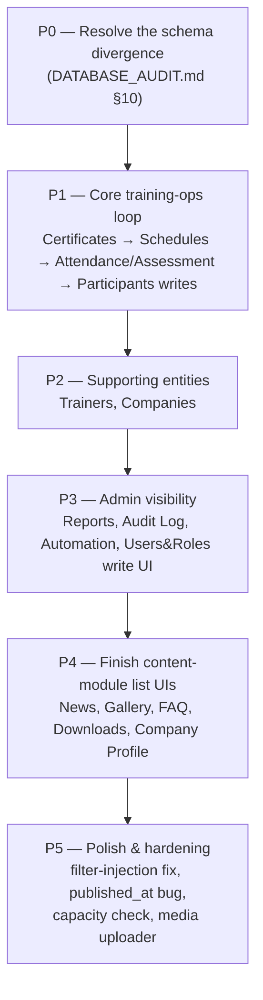

# Development Roadmap — TERAS UNIVERSAL Admin CMS

Documentation only — no code was changed to produce this file. Completion is assessed on **two axes**, not one: (1) how much UI/server-action code exists for a module, and (2) whether that code actually works against the **live** connected Supabase database (per `DATABASE_AUDIT.md`, which queried the project directly rather than inferring from migration files). A module with a fully-built CRUD UI that queries a table which doesn't exist in production is not "done" — it's built-but-non-functional, and is scored accordingly. Bug references are to `BUG_REPORT.md`.

Legend: ✅ **Completed** (built and functional against the live DB) · 🟡 **Partially Complete** (built but limited, missing pieces, or partially non-functional) · 🔴 **Missing** (not functional against the live DB regardless of how much UI code exists, or genuinely not built)

---

## 1. Foundation / Infrastructure

| Item | Status | Est. % | Notes |
|---|---|---|---|
| Database schema | 🔴 Missing (unresolved) | — | Two incompatible schema designs exist in `supabase/migrations/`; only one (the legacy + compatibility track) is actually deployed. This single item blocks the completion estimate of nearly every module below — see `DATABASE_AUDIT.md`. |
| Authentication | ✅ Completed | 90% | Login, session refresh, password reset all functional end-to-end. Deduct 10% for the two divergent login code paths (`profiles` vs `admin_users`) never being reconciled — see `BUG_REPORT.md` §12. |
| RBAC / role guards | ✅ Completed | 95% | `lib/auth/rbac.ts`/`session.ts` are fully implemented, consistent, and independent of the table-existence problem (they only query the live `profiles` table). |
| Middleware & routing | ✅ Completed | 100% | `/admin/:path*` gating, session refresh, redirect chain all work as designed. |
| Supabase client architecture | 🟡 Partially Complete | 60% | Server/browser/service clients are correctly structured, but `database.types.ts` types only 4 tables and `server.ts` casts to `any` — no compile-time protection against the schema mismatch that caused most of the bugs in `BUG_REPORT.md`. |
| Storage buckets | ✅ Completed | 90% | `media`/`downloads`/`private` buckets and policies exist and match what code expects. No dedicated upload UI outside a few forms (minor gap). |

---

## 2. Admin Modules

| Module | Status | Est. % | Why |
|---|---|---|---|
| **Courses** | ✅ Completed | 85% | Full CRUD, preview, Zod validation, and the live `courses` table has the columns this module actually writes (via the compatibility-track additions). Deduct for the live dual `status`/`cms_status` column drift and the `published_at`-reset bug (`BUG_REPORT.md` §6). |
| **News / Gallery / FAQ / Downloads** | 🟡 Partially Complete | 55% each | `actions.ts` + create/edit forms are fully built and match the live tables (`news_posts`, `gallery_images`, `faqs`, `downloads`). The list page for all four is a `ScaffoldPage` placeholder — genuinely missing UI, not a schema problem. News additionally has the `published_at` reset bug. |
| **Company Profile** | 🟡 Partially Complete | 50% | `saveCompanyProfile` action works against the live singleton table; the page itself is a stub with no real form wired up yet. |
| **Media Library** | 🟡 Partially Complete | 50% | Read-only browser works against live `media`/`media_folders`. No dedicated upload flow — files are attached via raw URL fields in other forms instead. |
| **Participants** | 🟡 Partially Complete (reads) / 🔴 broken (writes) | 30% | The live `participants` table exists, and read paths that only touch overlapping columns (`full_name`, `phone`, `email`, `company`, `schedule_id`) may work. Create/edit writes columns (`ic_passport_no`, `nationality`, `gender`, `date_of_birth`, `emergency_contact_name/phone`, `registration_date`, `company_id`) that don't exist live, and writes `status` values that violate the live 2-value CHECK constraint — every create/edit submission will be rejected by Postgres. |
| **Trainers** | 🔴 Missing | 10% | Fully coded (CRUD, CSV export) but the `trainers` table does not exist in the live database at all. 100% non-functional regardless of UI completeness. |
| **Companies** | 🔴 Missing | 10% | Same situation as Trainers — `companies` table does not exist live. |
| **Training Schedule** | 🔴 Missing | 15% | Extensive coded functionality (CRUD, duplicate, cancel, calendar view, trainer conflict check, participant assignment) all targets `training_schedules`, which does not exist live (only the simpler `course_schedules` does, and nothing in this module queries it). Also has the client-only capacity-check bug (`BUG_REPORT.md` §7). |
| **Attendance** | 🔴 Missing | 20% | UI and per-schedule marking flow are built, but every write uses `attendance_status`/`check_in_time`/`check_out_time`, none of which exist on the live `attendance` table (which only has `present boolean`/`session_date`). Also depends on `training_schedules` to even list schedules to mark attendance for. |
| **Assessment** | 🔴 Missing | 20% | Same shape of problem as Attendance — writes `theory_score`/`practical_score`/`competency_status`/`locked`, none of which exist live; also depends on `training_schedules`. |
| **Certificates** | 🟡 Partially Complete | 35% | The most heavily built module (issue/revoke, template system, bulk eligibility-based generation, ZIP export, QR/verification links) — but the core admin CRUD path writes `certificate_number`/`template_id`/`verification_token`/`verification_url`/`schedule_id`, almost none of which exist on the live `certificates` table. The **public verification path** (`/verify`, `verify_certificate_by_value` RPC) and the standalone `app/api/admin/certificates` route **do** match the live schema and are likely functional. Also has two real bugs independent of schema (race condition on duplicate generation, broken QR link on "Duplicate," no Zod validation) — see `BUG_REPORT.md` §2–4. |
| **Reports & Analytics** | 🔴 Missing | 15% | Charts, KPIs, and CSV export are built, but every data source is a `v_*` reporting view — none of which exist live. Every widget on this page will fail to load data. |
| **Automation Centre** | 🔴 Missing | 10% | System settings and run-history UI exist; `automation_runs`/`automation_templates` don't exist live. |
| **Audit Log** | 🔴 Missing | 10% | Read-only viewer is built; `audit_logs` doesn't exist live, so nothing has ever been logged and nothing can be shown. |
| **Users & Roles** | 🟡 Partially Complete | 35% | Read-only staff directory works against the live `profiles` table. Role assignment/deactivation UI was never built regardless of the schema question. |
| **Global Search** | 🟡 Partially Complete | 30% | Cross-entity search spans courses/participants/companies/schedules/certificates/trainers/news/downloads/media — only the subset backed by live tables (courses, participants partially, news, downloads, media) can return results; the rest silently contribute nothing. |
| **Backups** | 🔴 Missing | 10% | Read-only view of `audit_logs` entries — depends on a table that doesn't exist live. |
| **System Health** | 🟡 Partially Complete | 30% | DB connectivity and storage-usage checks are generic and likely work; automation-status and failed-job widgets depend on `automation_runs`, absent live. |
| **Dashboard** | 🟡 Partially Complete | 40% | Well-built KPI layout, but most of its widgets (upcoming schedules, certs issued/pending, recent assessments) query `training_schedules`/mismatched `certificates`/`assessments` columns and will fail to load; course-count and participant-count widgets are more likely to work. |

---

## 3. Public Website

| Item | Status | Est. % | Notes |
|---|---|---|---|
| Marketing pages (about, services, industries, contact, etc.) | ✅ Completed | 90% | Mostly static/hard-coded content, stable and functional independent of the CMS/schema question. |
| CMS-integrated pages (courses, gallery, FAQ, company info via `lib/public-content.ts`) | 🟡 Partially Complete | 60% | Courses/gallery/faq/company reads target live-matching tables and should work. |
| Upcoming Training Schedule (public calendar) | 🔴 Missing | 5% | `getUpcomingSchedules()` queries a table literally named `schedules`, which exists in neither live schema — this section of the public site returns nothing, unconditionally. |

---

## 4. Suggested Development Priority

1. **P0 — Fix the schema divergence first.** Every downstream estimate above assumes the current live schema. Until a decision is made (adopt the live legacy schema and rewrite operations-side modules to match it, or migrate the live database forward to the richer schema the code already assumes — `DATABASE_AUDIT.md` §10 lays out both options with trade-offs), no time spent inside Trainers, Companies, Schedules, Attendance, Assessment, or the certificate admin CRUD produces working software. This is a one-time, high-leverage decision that unblocks everything else.

2. **P1 — Core training-operations loop.** This project's own Supabase project is named "TERAS Certificate Verification," and `DELIVERABLE.md` frames the whole system around one end-to-end loop: create a course → schedule a session → register participants → mark attendance/assessment → issue a certificate → verify it publicly. Right now only the first and last steps (Courses, public verification) are solid. Certificates, Schedules, Attendance, Assessment, and Participants writes are the highest-business-value gap and should be the first thing rebuilt once P0 is resolved — while fixing the certificate-specific bugs already found (race condition, broken duplicate QR, missing Zod validation) in the same pass, since that code will be touched anyway.

3. **P2 — Trainers and Companies.** These are referenced by Schedules/Participants/Certificates (trainer assignment, company affiliation) but are self-contained enough to build right after the core loop is stable.

4. **P3 — Admin visibility tooling.** Reports, Audit Log, Automation Centre, and the Users & Roles write UI matter for operating the system day-to-day but don't block the core certificate-issuance workflow — reasonable to sequence after P1/P2.

5. **P4 — Finish the content-module list UIs.** News, Gallery, FAQ, Downloads, and Company Profile already have working backends; this is comparatively cheap, low-risk work (copy the Courses list-page pattern) that can happen in parallel with P2/P3 if there's spare capacity, since it doesn't touch the schema question at all.

6. **P5 — Cross-cutting hardening**, ideally folded into whichever module each fix touches rather than done as a separate pass: the filter-injection pattern on ~15 search/export endpoints (`BUG_REPORT.md` §5), the `published_at`-reset bug on Courses/News (§6), the client-only capacity check on Schedules (§7), the timezone-dependent attendance timestamps (§8), and building an actual media upload flow instead of raw URL fields.
