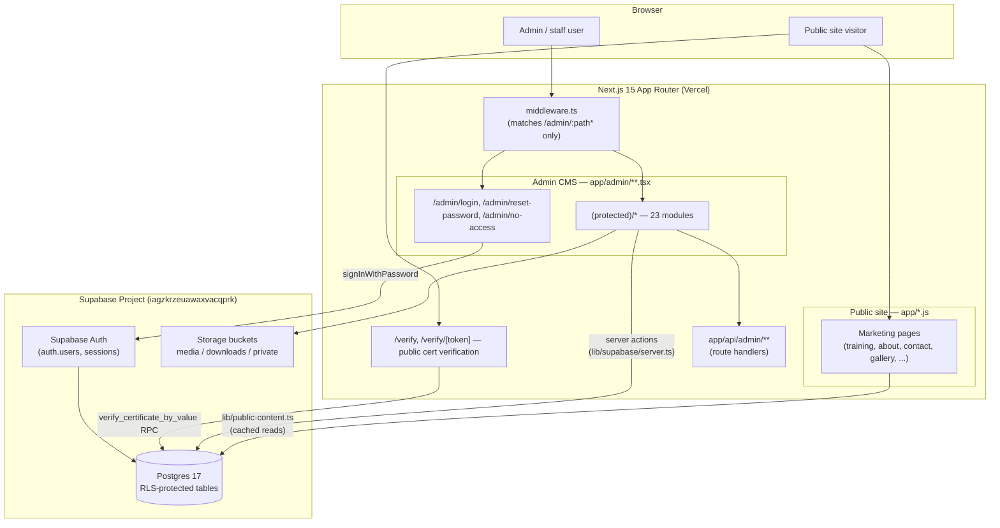
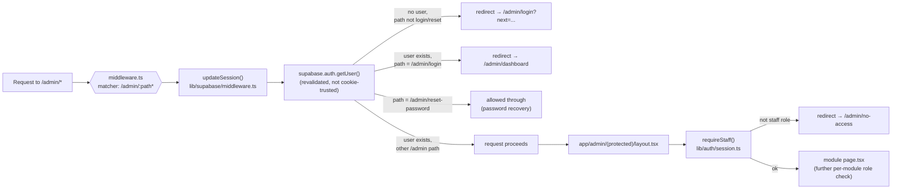
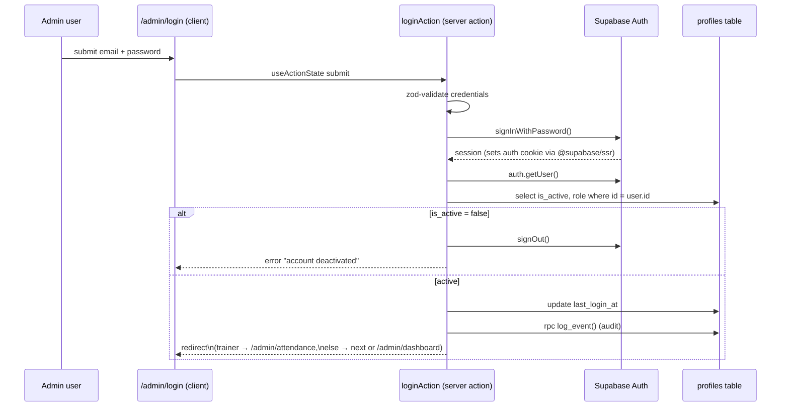
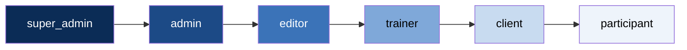
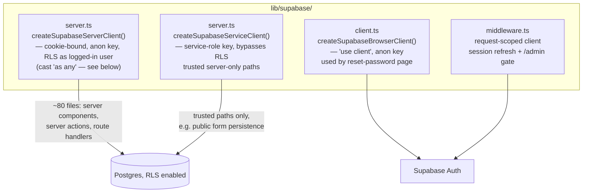
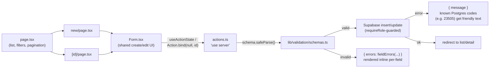
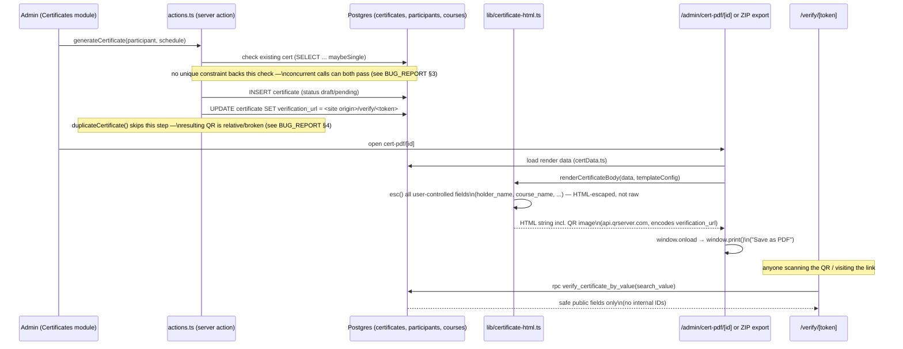

# System Architecture — TERAS UNIVERSAL

Documentation only — no code was changed to produce this file. It explains how the application is put together: the public site and admin CMS split, routing/middleware, authentication and RBAC, the Supabase integration, every admin module, and the certificate generation flow.

**Read this alongside `DATABASE_AUDIT.md`.** That audit established, via direct inspection of the live connected Supabase project, that the deployed database only has the "legacy" schema — not the richer schema (`training_schedules`, `trainers`, `companies`, `certificate_templates`, `audit_logs`, reporting views, etc.) that most of the operations-side modules below were coded against. This document describes the system **as designed/coded**; where a module's live functionality is in doubt because of that mismatch, it's noted inline.

---

## 1. High-Level Architecture

The public site (`.js`) and admin CMS (`.ts`/`.tsx`) are two halves of one Next.js deployment. `middleware.ts` is the only thing that distinguishes them at the routing layer — it matches `/admin/:path*` exclusively, so the public site is never touched by auth logic.

---

## 2. Middleware & Routing

Two layers of gating exist deliberately: `middleware.ts` handles cheap "are you logged in at all" redirects at the edge; `(protected)/layout.tsx` + each page's own `requireRole()`/`requireStaff()`/module-specific guard is the real defense-in-depth check, since middleware alone is not trusted as the sole gate (Server Components can be reached in ways middleware doesn't always intercept, e.g. React Server Component fetches).

---

## 3. Authentication

**Password reset** is a separate, deliberately-public flow: `app/api/admin/reset-password/route.js` is IP-throttled (60s, in-memory) and always returns a generic success response — it never reveals whether an account exists. It calls `resetPasswordForEmail()` with a redirect back to `/admin/reset-password`, which `middleware.ts` explicitly whitelists so the emailed recovery link works pre-"login." That page is a client component using the **browser** Supabase client (`lib/supabase/client.ts`, the only other consumer besides one incidental use) to call `auth.updateUser({ password })` against the short-lived recovery session.

**Two login code paths exist** (see `BUG_REPORT.md` §12): the login *page* calls the `profiles`-based server action above. A separate, UI-unreferenced route, `app/api/admin/login/route.js`, checks membership in an `admin_users` table instead. Both tables are live in the connected database; which one is actually authoritative should be resolved deliberately rather than left ambiguous.

---

## 4. RBAC (Role-Based Access Control)

`lib/auth/rbac.ts`'s `ROLE_ORDER` — **lower index = more privileged**, compared with `hasMinRole()`, never string equality.

| Guard (`lib/auth/session.ts`) | Used for | Behavior |
|---|---|---|
| `requireRole(min)` | Most modules | not signed in → `/admin/login`; inactive → `/admin/login?error=inactive`; under-role → `/admin/no-access`; else returns profile |
| `requireStaff()` | `(protected)/layout.tsx` | admits `super_admin/admin/editor/trainer` (excludes `client`/`participant`) — coarse "can enter the shell at all" gate |
| `requireAttendance(write?)` | Attendance module | view: editor or trainer; manage: admin or trainer — trainers sit *below* editor generally but need explicit rights here |
| `requireAssessment(write?)` | Assessment module | same split as attendance |
| `requireCertificate(manage?)` | Certificates module | view: editor or trainer; manage (generate/revoke): admin+ only |

`lib/admin-nav.ts`'s `MODULE_ACCESS` map mirrors these same minimums for sidebar rendering. **RLS in Postgres is the real enforcement boundary** — every guard above is explicitly a UI-side mirror of it, not a substitute (see `DATABASE_AUDIT.md` §7 for what RLS actually looks like on the live database, which differs from the RLS the numbered/unapplied migration track describes).

---

## 5. Supabase Integration

- **`database.types.ts`** is a **hand-curated, partial** type file — its own header says so. It types only `profiles`, `courses`, `enquiries`, `proposal_requests`; every other table falls back to `[key: string]: any`. Combined with `server.ts` casting its client `as any`, TypeScript provides essentially no protection against querying a table/column that doesn't exist — which is exactly the class of bug `DATABASE_AUDIT.md` and `BUG_REPORT.md` §1 document at scale.
- **Storage buckets**: `media` (public), `downloads` (public), `private` (no anon access). Public buckets: anyone reads, editors write, admins delete. Private bucket: nothing anon-readable at all.
- **RLS**: every table has row-level security enabled. The live database's actual policy shapes are a mix of an older `admin_users`-membership model and a newer `profiles.role`-based model, running simultaneously — see `DATABASE_AUDIT.md` §7.

---

## 6. Server Actions, API Routes, and the CRUD Module Pattern

Mutations go through **Server Actions**, not Route Handlers, as the default convention. Every fully-built CRUD module follows the same shape:

**Courses is the reference implementation** (`app/admin/(protected)/courses/`) — copy its `page.tsx`/`new/page.tsx`/`[id]/page.tsx`/`CourseForm.tsx`/`actions.ts` split when building or extending a module. `components/admin/ScaffoldPage.tsx` marks modules whose list UI isn't built yet even where the data layer/actions are complete (News, Gallery, FAQ, Downloads, Company Profile).

**Route handlers** (`app/api/admin/**`) are the exception, reserved for things that aren't plain form submissions: CSV import/export (`*/export/route.ts`, `*/import/importActions.ts`), the throttled public password-reset endpoint, and two standalone routes (`app/api/admin/login`, `app/api/admin/certificates`) that — per `DATABASE_AUDIT.md` — actually target the live legacy schema more accurately than their `(protected)` module counterparts do.

---

## 7. Admin Modules

| Module | Route | Min role | Summary |
|---|---|---|---|
| **Dashboard** | `/admin/dashboard` | any staff | KPI overview (courses, upcoming schedules, certs issued/pending, participants, recent assessments); trainers are redirected to Attendance instead. |
| **Courses** | `/admin/courses` | editor (admin for delete/publish-sensitive ops) | Full CRUD + preview, Zod-validated (`courseSchema`). The one module whose schema is confirmed to match the live database (via the compatibility-track columns on `courses`). |
| **Schedules** | `/admin/schedules`, `/calendar` | editor read / admin write | CRUD + trainer double-booking check + participant assignment + calendar view + CSV export. Coded against `training_schedules`, which does not exist live (see §1 caveat). |
| **Participants** | `/admin/participants`, `/import` | editor read / admin write | CRUD + CSV export/import, register-to-schedule. Coded against columns (`ic_passport_no`, `nationality`, `company_id`, etc.) that don't exist on the live `participants` table. |
| **Attendance** | `/admin/attendance/[scheduleId]` | trainer (editor read-only / admin+trainer manage) | Per-schedule marking + CSV export/import. Coded against an `attendance_status` enum and `check_in_time`/`check_out_time` columns absent from the live table (which has `present boolean`/`session_date` instead). |
| **Assessment** | `/admin/assessment/[scheduleId]` | trainer (same split as Attendance) | Per-schedule competency/pass-fail results + export. Coded against `theory_score`/`practical_score`/`competency_status`/`locked`, absent live. |
| **Certificates** | `/admin/certificates`, `/generate`, `/templates` | editor view / admin manage | Issue/revoke, eligibility-based bulk generation, template CRUD, ZIP download, public verify links. See §8 for the generation flow. Coded against `certificate_number`/`verification_token`/`template_id`, mostly absent from the live `certificates` table (which uses `certificate_no`, no template FK). |
| **Trainers** | `/admin/trainers` | editor read / admin write | Full CRUD + CSV export. The `trainers` table does not exist live — module cannot function against the connected database as coded. |
| **Companies** | `/admin/companies` | editor read / admin write | Client-company records CRUD + export. The `companies` table does not exist live. |
| **News** | `/admin/news` | editor | List page is a placeholder (`ScaffoldPage`); create/edit and `actions.ts` (Zod `newsSchema`) are fully implemented and match the live `news_posts`/`news_categories` tables. |
| **Gallery** | `/admin/gallery` | editor | Same pattern as News — list UI pending, CRUD works against live `gallery_images`/`gallery_categories`. |
| **FAQ** | `/admin/faq` | editor | Same pattern — CRUD works against live `faqs`/`faq_categories`. |
| **Downloads** | `/admin/downloads` | editor | Same pattern — CRUD works against live `downloads`. |
| **Company Profile** | `/admin/company` | editor | Singleton; page is a stub, but the `saveCompanyProfile` action works against the live `company_profile` row. |
| **Media Library** | `/admin/media` | editor | Read-only browser over `media`/`media_folders` (both live); no dedicated uploader — uploads happen via URL fields in other forms. |
| **Reports & Analytics** | `/admin/reports` | editor | Charts + CSV export over `v_*` reporting views, none of which exist live. |
| **Automation Centre** | `/admin/automation` | admin | System settings, email templates, run-history log over `automation_runs`/`automation_templates`, absent live. |
| **Audit Log** | `/admin/audit` | admin | Read-only `audit_logs`, absent live. |
| **Users & Roles** | `/admin/users` | super_admin | Read-only staff directory over `profiles` (live); role/activation editing not yet built in the UI regardless. |
| **Backups** | `/admin/backups` | admin | Read-only view of backup-related audit entries; provider-managed, no in-app trigger. |
| **System Health** | `/admin/system` | admin | DB connectivity, storage usage, automation status, failed-job count. |
| **Global Search** | `/admin/search` | editor | Cross-entity search across courses/participants/companies/schedules/certs/trainers/news/downloads/media. |

Public certificate verification (`/verify`, `/verify/[token]`) is separate from all of the above — no auth, calls the live `verify_certificate_by_value` RPC directly (see `DATABASE_AUDIT.md` §1).

---

## 8. Certificate Generation Flow

**Bulk generation** (`bulkGenerate` in `certificates/actions.ts`) loops `generateCertificate()` once per eligible participant sequentially — no batching, so a 50-participant schedule issues roughly 250 sequential Supabase calls (five per participant: eligibility check, existing-cert check, template lookup, insert, verification-URL update). See `BUG_REPORT.md` §11.

**ZIP download** (`certificates/download-zip/route.ts`) uses `lib/zip.ts` + `lib/certificate-html.ts`'s `renderCertificateDocument()` directly (not React/`react-dom/server`, which Next's App Router route handlers can't use) to build each certificate as a standalone printable HTML string, bundled into a ZIP for bulk download.

**HTML escaping**: `lib/certificate-html.ts`'s `esc()` HTML-escapes every user-controlled field (`holder_name`, `course_name`, IC/passport, config labels) before interpolation — confirmed by direct code read, not a bug.
